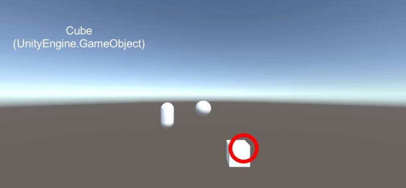

# Object Click
This sample detect `GameObject` with `RayCast` and return the detected Object through the stream. If you have subscribed to `onSelectObjectStream`, you can get the detected `GameObject` through the stream whenever an Object is detected.

## Result


## Source
```csharp
Observable.EveryUpdate()
        .Where(_ => Input.GetMouseButtonDown(0))
        .Select(_ => true)
        .Subscribe(_ => {
            RaycastHit hit;
            Ray ray = Camera.main.ScreenPointToRay(Input.mousePosition);
            if(Physics.Raycast(ray, out hit)) {
                GameObject ClickedObject = hit.collider.gameObject;
                onSelectObjectStream.OnNext(ClickedObject);
            }
        });
```
1. Get `GetMouseButtonDown(0)` and select `GetMouseButtonDown(0)`is `true`
2. Create `Ray` and run `Raycast`
3. If RaycastHit! streaming `ClickedObject` through `onSelectObjectStream`

```csharp
[SerializeField]
private CameraRayCaster cameraRayCaster;

cameraRayCaster.OnSelectObjectAsObservable
        .Subscribe(x => {
            /*    ...    */
            /* your code */
            /*    ...    */
        });
```
1. Subscribe this stream When you need
2. USE IT!
