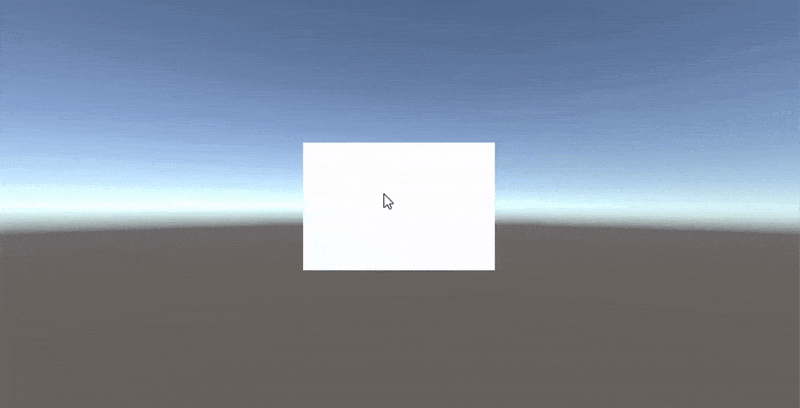

# Drag Object
This sample is rotate cube object using `OnMouseDownAsObservable` and `OnMouseUpAsObservable` stream. Mixed use of `SkipUntil` & `TakeUntil` is very useful like this sample.
For example, `SkipUntil(A)` and `TakeUntil(B)` can easily create things that happen between A and B.

## Result


## Source
```csharp
Observable.EveryUpdate()
    .SkipUntil(this.OnMouseDownAsObservable())
    .Select(_ => new Vector2(Input.GetAxis("Mouse X"), Input.GetAxis("Mouse Y")))
    .TakeUntil(this.OnMouseUpAsObservable())
    .Repeat()
    .Subscribe(move => {
        this.transform.rotation = Quaternion.AngleAxis(move.y * rotationSpeed * Time.deltaTime, Vector3.right) * Quaternion.AngleAxis(-move.x * rotationSpeed * Time.deltaTime, Vector3.up) * transform.rotation;
    });
```
1. This Sample use `.SkipUntil(this.OnMouseDownAsObservable())` and `.TakeUntil(this.OnMouseUpAsObservable())`
2. Now you can write code between OnMouseDown and OnMouseUp
