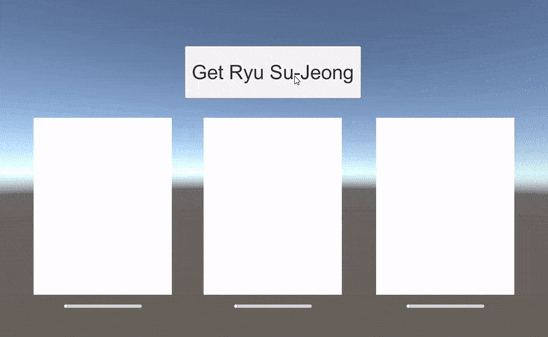

# WWW
Download texture with `ObservableWWW`. and make simple `download process bar`.

## Result


## Source
```csharp
button.OnClickAsObservable()
        .First()
        .SelectMany(ObservableWWW.GetWWW("http://t1.daumcdn.net/liveboard/newsade/e91ec5e3f766486191dee5010e8c27cd.jpg", null, progress0))
        .Select(www => Sprite.Create(www.texture, new Rect(0, 0, www.texture.width, www.texture.height), Vector2.zero))
        .Subscribe(sprite => {
            image[0].sprite = sprite;
            button.interactable = false;
        }, Debug.LogError);
```
1. Use button `OnClickAsObservable` and detect first click by `First` operater
2. And replace stream with `ObservableWWW.GetWWW` by `SelectMany`
3. Create and replace www to Sprite by `Select`
4. Change sprite

```csharp
ScheduledNotifier<float> progress0 = new ScheduledNotifier<float>();
progress0.Subscribe(prog => slider[0].value = prog);

/* ... */

button.OnClickAsObservable()
        .First()
        .SelectMany(ObservableWWW.GetWWW(url, null, progress0))

/* ... */

```

1. Make and pass `ScheduledNotifier<float>` to `ObservableWWW.GetWWW`'s parameter.
2. And Subscribe `ScheduledNotifier<float>` for progress slider value.
